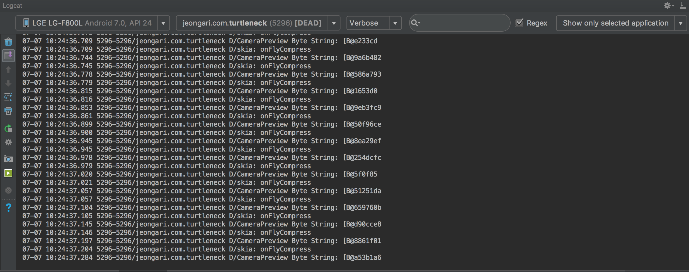

## DONE

- 카메라 후면 Preview
- Callback을 통해 프리뷰 화면 비트맵 추출
- 비트맵 Byte Code화 해서 출력(모델의 Input이 된다!)
- 히트맵에서 추출된 결괏값이 있다고 가정했을 때, 화면에 매핑 (예전 작업본)

## TODO - Working

- ImageClassifier 
구글이 제시한 java 예제를 보고 따라 만들어보려고 했으나 어려움을 많았음😭

- ImageClassifierPoseEstimation
ImageClassifier를 상속 받아서 PoseEstimation CPM 모델에 맞게 구체화

## 결론

**1. 코틀린 데모 앱 상위 두 부분의 클래스 구조를 분석해서 정리해본다.**

**2. 주말 동안 코틀린 기초 문법을 빠르게 익혀 java 코드로 만든다.**
